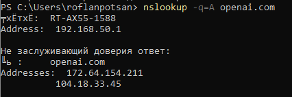
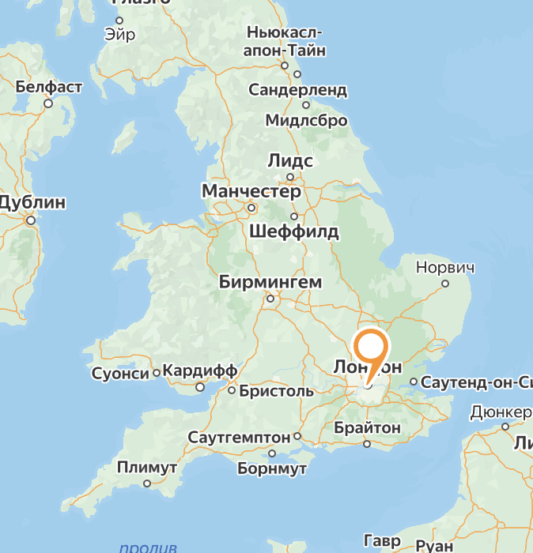
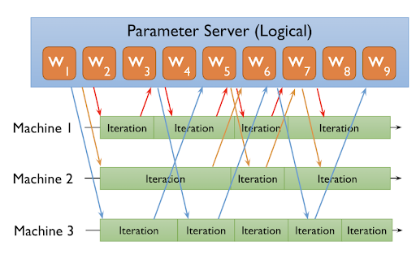
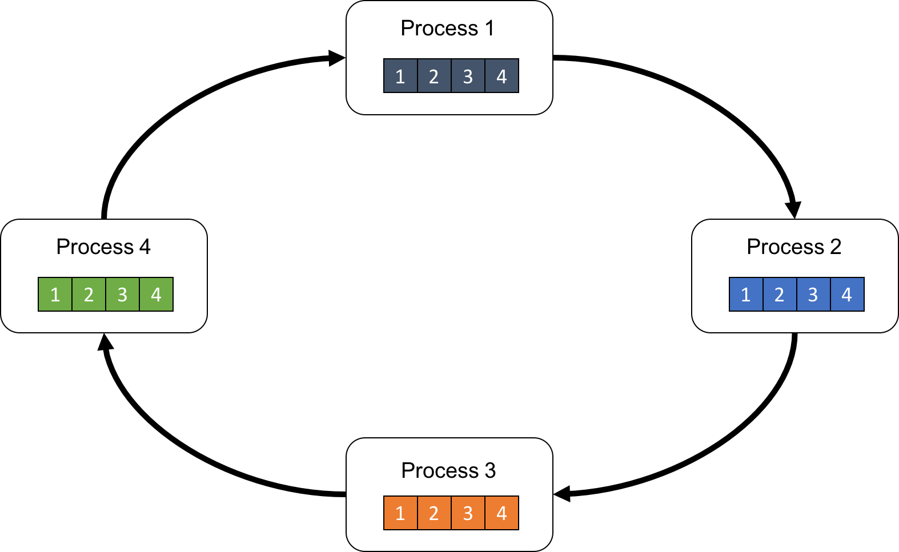
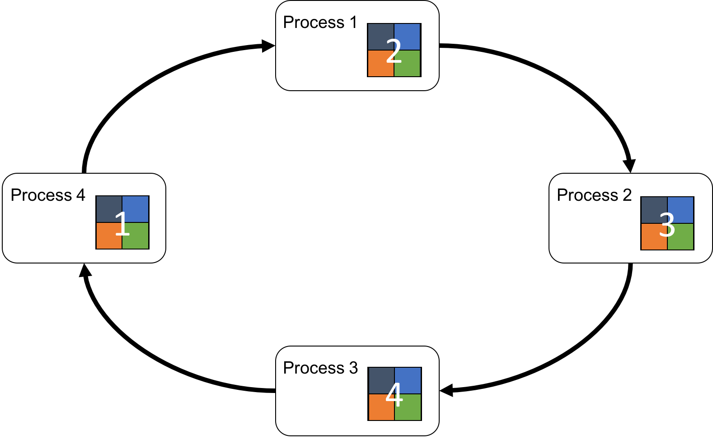
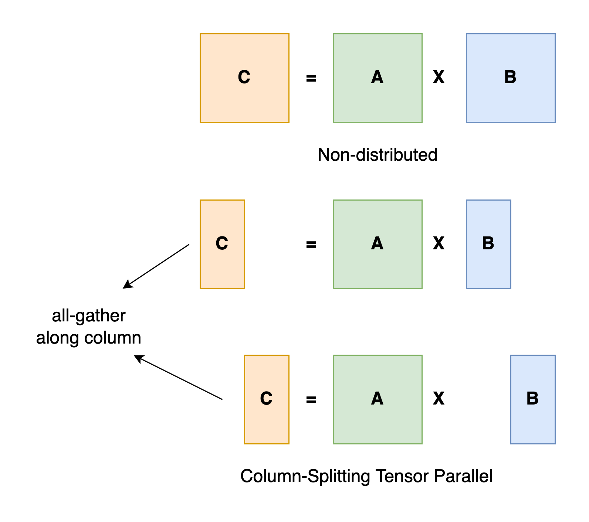
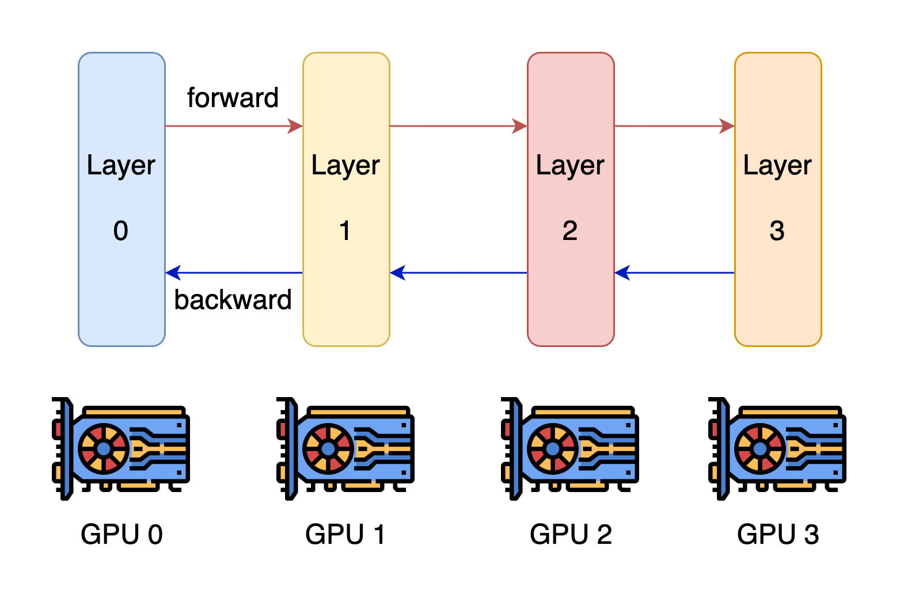
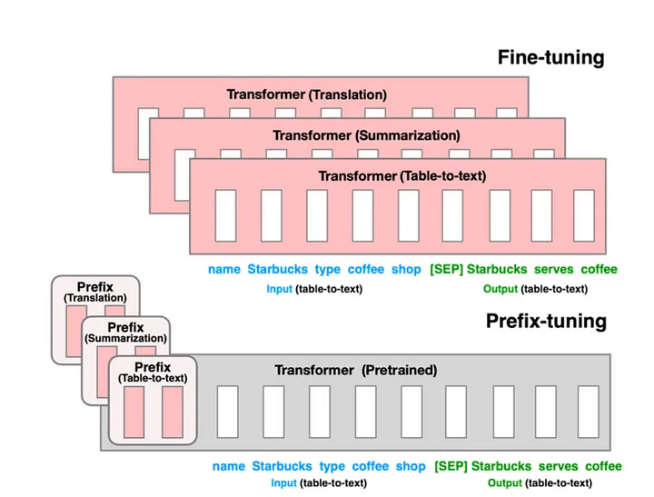

# WEB-31 Долматов Фёдор Highload

## [ChatGPT](https://chatgpt.com)

## Содержание

[_1. Тема и целевая аудитория_](#1-тема-и-целевая-аудитория)

[_2. Расчёт нагрузки_](#2-расчёт-нагрузки)

[_3. Глобальная балансировка нагрузки_](#3-глобальная-балансировка-нагрузки)

[_4. Локальная балансировка нагрузки_](#4-локальная-балансировка-нагрузки)

[_5. Логическая схема БД_](#5-логическая-схема-бд)

[_6. Физическая схема БД_](#6-физическая-схема-бд)

[_7. Распределенные алгоритмы_](#7-распределенные-алгоритмы)

[_8. Технологии_](#8-технологии)

[_9. Схема проекта_](#9-схема-проекта)

[_10. Обеспечение надежности_](#10-обеспечение-надежности)

## 1. Тема и целевая аудитория

### Описание

- ChatGPT - это AI-чатбот для общения, поиска информации, решения задач с помощью генеративных LLM.

### Целевая аудитория

ChatGPT имеет ~ 121.3 MAU, наибольшее число пользователей находится в Индии и США[1].

- Местоположение

| Страна         | Процент пользователей |
| -------------- | --------------------- |
| Индия          | 15.26%                |
| США            | 14.43%                |
| Великобритания | 4.67%                 |
| Бразилия       | 4.62%                 |
| Другие страны  | 61.02%                |

- Возраст

| Возраст | Процент пользователей |
| ------- | --------------------- |
| 18-24   | 23.19%                |
| 25-34   | 33.95%                |
| 35-44   | 20.65%                |
| 45-54   | 12.27%                |
| 55-64   | 6.45%                 |
| 65+     | 3.49%                 |

### MVP функционал

- Регистрация, авторизация
- Обучение модели / разметка данных
- Обработка текстовых запросов моделью
- Система оценки ответов
- История чатов
- Обработка вложений моделью

### Ключевые продуктовые решения

- Возможность обращаться к сторонним сервисам с помощью модели
- Дообучение модели (на основе фидбека)
- Монетизация (доступ к более новым версиям модели)

## 2. Расчёт нагрузки

### Продуктовые метрики [[2](#список-источников)]:

| Метрика | Значение   |
| ------- | ---------- |
| MAU     | > 100 млн. |
| DAU     | ~ 9 млн.   |

- Поскольку точные данные отсутствуют, расчет DAU был выполнен на основе предположения, что каждый пользователь активен 10-15 (~13) дней в месяц, при общем количестве ~121 млн MAU.
- Средний размер хранилища пользователя:

| Данные                              | Объем                               |
| ----------------------------------- | ----------------------------------- |
| История чатов                       | ((75 \* n + (225 + 1) \* m) \* k) Б |
| Медиафайлы                          | (0,5 \* i \* k) МБ                  |
| Настройки персонализации и аккаунта | 1 МБ                                |

- Средний размер вопроса от пользователя ~ 10 слов [[3](#список-источников)] (50 символов) = 50 - 100 Б (В зависимости от языка), в среднем 75 Б
- Средний размер медиафайла при запросе ~ 0,5 МБ
- Средний размер ответа модели ~ 30 слов [[3](#список-источников)] (150 символов) = 150 - 300 Б (В зависимости от языка), в среднем 225 Б + 1 Б на информацию об оценке ответа
- Учитывая, что в одном чате может храниться несколько сообщений, как от пользователя, так и от модели, то необходимо умножить объемы, занимаемые ими, на соответствующие коэффициенты: n - количество сообщений от пользователя, m - количество ответов от модели, k - количество чатов / год.
- Аналогично с медиафайлами, которых в одном чате в среднем i штук.
- В среднем n = m = 6 (на каждый запрос один ответ), k = 156 (13 дней в месяц / год), i = 0,25
- После рассчета получаем в среднем на одного пользователя / год:

| Данные                              | Объем  |
| ----------------------------------- | ------ |
| История чатов                       | 282 КБ |
| Медиафайлы                          | 20 МБ  |
| Настройки персонализации и аккаунта | 1 МБ   |

- Средний размер хранилища модели
- По данным OpenAI [[4](#список-источников)] размер модель GPT-4 имеет ~ 1,8 трлн. параметров, при весе одного параметра ~ 4Б (float32), итоговый размер самой модели 1,8 \* 10 ^ 12 \* 4 Б ~ 7,2 ТБ

| Данные                | Объем       |
| --------------------- | ----------- |
| Обученная модель      | > 7,2 ТБ    |
| Данные для обучения   | > 950 ГБ    |
| Данные для дообучения | > 50 ГБ/мес |

- Среднее количество действий пользователя по MVP:

| Действие                               | Количество в день на одного пользователя (в среднем) |
| -------------------------------------- | ---------------------------------------------------- |
| Регистрация                            | 0,0027 (1 / год)                                     |
| Авторизация                            | 0,033 (1 / месяц)                                    |
| Открытие страницы чата                 | 2                                                    |
| Получение истории чатов                | 1                                                    |
| Получение данных пользователя          | 1                                                    |
| Отправка текстового запроса для модели | 2                                                    |
| Отправка медиа-запроса для модели      | 0,5                                                  |
| Отправка оценки на ответ модели        | 0,033                                                |

### Технические метрики

#### Хранилище:

Расчет объема хранилища на n лет:

- Данные для дообучения ~ 24 \* 10 ГБ ~ 240 ГБ
- Модели и исходные данные для их обучения ~ 1,2 ТБ
- При линейно растущем числе пользователей (10% / год) объем данных (282 КБ + 20 МБ + 1 МБ) ~ 21.3 МБ нужно умножить на 121 \* 10 ^ (1 - n) \* (11 ^ n - 10 ^ n) // хранить данные для 121 млн пользователей за n лет, 121 \* 1,1 за n - 1 лет и т.д.
- Для n = 2 получим (21,3 \* (121 + 121 \* 1,1) \* 10 ^ 6) МБ + (7,2 ТБ + 950 ГБ + 50 ГБ \* 12) \* 2 ~ **5,49 ПБ**

#### RPS

- RPS = DAU / (24 \* 60 \* 60) \* Кол-во действий в среднем на пользователя
- RPS (пик ~ 1.5х нагрузка (предположительно)):

| Действие                               | RPS   | RPS (пик) |
| -------------------------------------- | ----- | --------- |
| Регистрация                            | 0,28  | 0,42      |
| Авторизация                            | 3,44  | 5,16      |
| Открытие страницы чата                 | 104,2 | 156,3     |
| Получение медиа данных                 | 104,2 | 156,3     |
| Получение истории чатов                | 104,2 | 156,3     |
| Получение данных пользователя          | 104,2 | 156,3     |
| Отправка текстового запроса для модели | 208,4 | 312,6     |
| Отправка медиа-запроса для модели      | 52    | 78,2      |
| Отправка оценки на ответ модели        | 3,44  | 5,16      |

#### Сетевой трафик

Основной трафик приходится на открытие страницы чата, получение медиа-данных и данных пользователя, отправку текстового/медиа-запросов модели:

| Действие                               | Трафик                                                             | Трафик (пик)                                 | Трафик в сутки                       |
| -------------------------------------- | ------------------------------------------------------------------ | -------------------------------------------- | ------------------------------------ |
| Открытие страницы чата                 | 104,2 \* (1,8 КБ) ~ 187 КБ/c ~ 1,5 Мбит/c                          | 156,3 \* (1,8 КБ + 0.5 МБ) ~ 2,25 Мбит/с     | 1,5 Мбит/c \* 86400 c ~ 16,2 ГБ/сут  |
| Получение медиа данных                 | 104,2 \* (0,5 МБ) ~ 52,1 МБ/c ~ 416,8 Мбит/c                       | 156,3 \* (1,8 КБ + 0.5 МБ) ~ 625,2 Мбит/с    | 416,8 Мбит/c \* 86400 c ~ 4,5 ТБ/сут |
| Получение истории чатов                | 104,2 \* 156 \* 40 Б (размер заголовка чата) ~ 650 КБ/с ~ 5 Мбит/с | 156,3 \* 156 \* 40 Б ~ 8 Мбит/с              | 5 Мбит/с \* 86400 с ~ 54 ГБ/сут      |
| Получение данных пользователя          | 104,2 \* 1 МБ ~ 104,2 МБ/с ~ 834 Мбит/с                            | 156,3 \* 1 МБ ~ 1251 Мбит/c                  | 834 Мбит/с \* 86400 с ~ 9 ТБ/сут     |
| Отправка текстового запроса для модели | 208,4 \* (75 Б + 226 Б) ~ 63 КБ/c ~ 0,5 Мбит/c                     | 312,6 \* (75 Б + 226 Б) ~ 0,75 Мбит/с        | 0,5 Мбит/с \* 86400 с ~ 5,4 ГБ/сут   |
| Отправка медиа-запроса для модели      | 52 \* (0.5 МБ + 75 Б + 226 Б) ~ 28 МБ/c ~ 221 Мбит/с               | 78,2 \* (0.5 МБ + 75 Б + 226 Б) ~ 332 Мбит/с | 221 Мбит/с \* 86400 с ~ 2,4 ТБ/сут   |

## 3. Глобальная балансировка нагрузки

### Обоснования расположения ДЦ

- Сервера OpenAI находятся исключительно на территории США по данным с официального сайта компании [[5](#список-источников)] (Но используется Anycast).
  > 
  >
  > 
- Пользуясь картой провайдеров [[6](#список-источников)] можно составить список локаций для ДЦ:
  - Сан-Франциско
  - Даллас
  - Нью-Йорк
- Если учитывать, что большая часть трафика идет извне США (см. [Целевая аудитория](#Целевая-аудитория)), то как минимум можно добавить ДЦ для наиболее нагруженных точек мира (Индии, Великобритании), однако в настоящее время ДЦ там нет:
  - Лондон
  - Нью-Дели

Карта с расположением датацентров доступна по [ссылке](https://yandex.ru/maps/?um=constructor%3A53944f7d66f5ff40150fb989d6e66a18acb46857c307120b910fd01c05a8b6a0&source=constructorLink).

### Схема балансировки

Используя GeoDNS для определения региона пользователя (США, Европа или Азия) и BGP Anycast для распределения нагрузки внутри США между тремя датацентрами, можно обеспечить глобальную доступность сервисов и минимизировать задержки за счёт оптимальных маршрутов внутри основного региона.

## 4. Локальная балансировка нагрузки

Для обеспечения отказоустойчивости и балансировки будут использоваться K8s и Nginx.

### L3 балансировка

- Virtual Server via Direct Routing
  - В отличие от via NAT запросы приходят на VIP балансировщика и идут по определенным маршрутам на серверы (BGP/ RIP), серверы сразу отправляют ответ пользователям.

### L7 балансировка

- Nginx
  - поддержка различных алгоритмов балансировки: Nginx позволяет использовать различные методы распределения трафика (RR)
  - терминация SSL, разгрузка бэкенд-серверов: Nginx может выполнять шифрование и расшифровку SSL/TLS-трафика, снимая эту нагрузку с приложений.

### Отказоусточивость

- Kubernetes
  - автоматически перезапускает упавшие контейнеры и перераспределяя поды при сбоях узлов (liveness, readiness), тем самым поддерживая непрерывность работы приложений.
- Nginx
  - встроенные механизмы отказоустойчивости: Возможность автоматического временного исключения недоступных бэкендов из пула серверов.

## 5. Логическая схема БД

Конечно! Теперь я добавил описание всех `JSON` и `enum` полей в табличку:

| Название таблицы      | Поле                        | Описание                                                                                                                       |
| --------------------- | --------------------------- | ------------------------------------------------------------------------------------------------------------------------------ |
| **Training_data**     | `training_data_id`          | PK, идентификатор набора данных                                                                                                |
|                       | `training_id`               | FK на таблицу `Training`                                                                                                       |
|                       | `file_url`                  | Ссылка на файл с данными                                                                                                       |
|                       | `source_text`               | Исходные текстовые данные (если не в файле)                                                                                    |
|                       | `data_type`                 | Тип данных (enum): `image`, `text`, `audio`, `video`                                                                           |
|                       | `labels`                    | Разметка (JSON): {labels: ['cat', 'huge', ...]}                                                                                |
|                       | `embedding_vectors`         | Векторное представление (JSON): {vector: [float1, float2, ..., floatN]}                                                        |
|                       | `created_at`                | Дата создания размеченных данных                                                                                               |
| **Training**          | `training_id`               | PK, идентификатор обучения                                                                                                     |
|                       | `hyper_parameters`          | Гиперпараметры обучения (JSON): {param1: value1, param2: value2, ...}                                                          |
|                       | `eval_score`                | (JSON): {f1_score: value, accuracy: value, recall: value, ...}                                                                 |
|                       | `train_start_time`          | Время начала обучения                                                                                                          |
|                       | `train_end_time`            | Время окончания обучения                                                                                                       |
| **Model_deployment**  | `deployment_model_id`       | PK, идентификатор деплоя модели                                                                                                |
|                       | `model_version_id`          | FK на таблицу `Model_version`                                                                                                  |
|                       | `status`                    | Статус деплоя (enum): `deployed`, `pending`, `failed`, `inactive`                                                              |
|                       | `deployed_at`               | Дата деплоя                                                                                                                    |
| **Model_version**     | `model_version_id`          | PK, идентификатор версии модели                                                                                                |
|                       | `parent_model_version_id`   | FK на родительскую версию модели                                                                                               |
|                       | `training_id`               | FK на таблицу `Training`                                                                                                       |
|                       | `file_url`                  | Ссылка на файл модели                                                                                                          |
|                       | `created_at`                | Дата создания версии модели                                                                                                    |
| **Model_performance** | `performance_id`            | PK, идентификатор метрик производительности                                                                                    |
|                       | `model_version_id`          | FK на таблицу `Model_version`                                                                                                  |
|                       | `metric_type`               | Тип метрики (enum): `latency`, `throughput`, `memory_usage`, `cpu_usage`, `gpu_usage`, `token_usage` и т. д.                   |
|                       | `metric_value`              | Значение метрики                                                                                                               |
|                       | `calculated_at`             | Время расчета метрики                                                                                                          |
|                       | `evaluation_window_start`   | Начало окна для расчета метрики                                                                                                |
| **User**              | `user_id`                   | PK, идентификатор пользователя                                                                                                 |
|                       | `email`                     | Email пользователя                                                                                                             |
|                       | `password_hash`             | Хэш пароля                                                                                                                     |
|                       | `account_status`            | Статус аккаунта (enum): `active`, `inactive`, `suspended`, `deleted`                                                           |
|                       | `created_at`                | Дата создания аккаунта                                                                                                         |
| **User_settings**     | `setting_id`                | PK, идентификатор настроек                                                                                                     |
|                       | `user_id`                   | FK на таблицу `User`                                                                                                           |
|                       | `theme`                     | Цветовая палитра сайта (enum): `light`, `dark` и т. д.                                                                         |
|                       | `language`                  | Язык пользователя (enum): `en`, `ru` и т. д.                                                                                   |
|                       | `memory`                    | Boolean, включена ли память для общего контекста                                                                               |
|                       | `custom_pre_prompt`         | Индивидуальный prompt пользователя для каждого запроса                                                                         |
|                       | `custom_personalize_prompt` | Индивидуальный prompt пользователя для пероснализации ответов                                                                  |
|                       | `notification_preference`   | Настройка уведомлений (enum): `all`, `security`, `off `                                                                        |
|                       | `api_key`                   | API ключ пользователя                                                                                                          |
| **Media**             | `media_id`                  | PK, идентификатор медиафайла                                                                                                   |
|                       | `user_id`                   | FK на таблицу `User`                                                                                                           |
|                       | `file_url`                  | URL медиафайла                                                                                                                 |
|                       | `file_type`                 | Тип файла (enum): `image`, `video`, `audio`, `text`, `other`                                                                   |
|                       | `uploaded_at`               | Дата загрузки медиафайла                                                                                                       |
| **Files**             | `file_id`                   | PK, идентификатор файла                                                                                                        |
|                       | `file_url`                  | URL файла                                                                                                                      |
|                       | `data`                      | Данные файла (binary)                                                                                                          |
| **Event**             | `event_id`                  | PK, идентификатор события                                                                                                      |
|                       | `user_id`                   | FK на таблицу `User`                                                                                                           |
|                       | `chat_id`                   | FK на таблицу `Chats`                                                                                                          |
|                       | `msg_id`                    | FK на таблицу `Chat_messages`                                                                                                  |
|                       | `media_id`                  | FK на таблицу `Media`                                                                                                          |
|                       | `model_version_id`          | FK на таблицу `Model_version`                                                                                                  |
|                       | `training_id`               | FK на таблицу `Training`                                                                                                       |
|                       | `deployment_model_id`       | FK на таблицу `Model_deployment`                                                                                               |
|                       | `event_type`                | Тип события (enum): `user_login`, `user_logout`, `message_sent`, `file_uploaded`, `training_started`, `model_deployed` и т. д. |
|                       | `event_data`                | JSON: {event_data: {...}}                                                                                                      |
|                       | `created_at`                | Дата события                                                                                                                   |
| **Chats**             | `chat_id`                   | PK, идентификатор чата                                                                                                         |
|                       | `user_id`                   | FK на таблицу `User`                                                                                                           |
|                       | `model_version_id`          | FK на таблицу `Model_version`                                                                                                  |
|                       | `title`                     | Название чата                                                                                                                  |
|                       | `last_updated`              | Время последнего обновления чата                                                                                               |
| **Chat_messages**     | `msg_id`                    | PK, идентификатор сообщения                                                                                                    |
|                       | `chat_id`                   | FK на таблицу `Chats`                                                                                                          |
|                       | `media_id`                  | FK на таблицу `Media`                                                                                                          |
|                       | `content`                   | Текст сообщения                                                                                                                |
|                       | `author`                    | Автор сообщения (enum): `user`, `system`                                                                                       |
|                       | `last_updated`              | Время последнего обновления                                                                                                    |
|                       | `is_prompt`                 | Boolean, является ли сообщение prompt'ом                                                                                       |
|                       | `is_memo`                   | Boolean, используется ли как память для общего контекста                                                                       |
|                       | `via_api`                   | Boolean, было ли сообщение передано через API                                                                                  |
|                       | `rating`                    | Рейтинг сообщения (enum): `positive`, `none`, `negative`                                                                       |
|                       | `embedding_vector`          | Векторное представление (JSON): {vector: [float1, float2, ..., floatN]}                                                        |
|                       | `tokens_used`               | Число использованных токенов (integer)                                                                                         |
| **Session**           | `session_id`                | PK, идентификатор сессии                                                                                                       |
|                       | `user_id`                   | FK на таблицу `User`                                                                                                           |
|                       | `sid_hash`                  | Хэш сессии                                                                                                                     |
|                       | `created_at`                | Время создания сессии                                                                                                          |
|                       | `expires_at`                | Время окончания сессии                                                                                                         |

Размеры данных приведены в разделе [Расчёт нагрузки](#2-расчёт-нагрузки).

Нагрузка на чтение/запись:

- Учитывая расчеты RPS, можно предположить, что количество запросов на чтение ~= количеству запросов на запись ~= 300RPS.
- Поскольку в основном пользователь будет в заимодействовать с отправкой сообщений модели, то логично было бы разделить нагрузку по ключам **user_id** и **chat_id**.

Консистентность:

- Несмотря на то, что RPS на чтение и запись практически равны, один конкретный пользователь отправляет больше новых сообщений, чем читает предыдущие чаты, поэтому можно применить модель **eventual consistency**.

## 6. Физическая схема БД

### Индексы

#### Model

Индекс на поле `version_number` для быстрого поиска моделей по версии.

#### User

Индекс на поле `email` для быстрого поиска пользователей по email.

#### Session

Индекс на поле `user_id` для ускорения поиска сессий по пользователю.

#### Model_performanc

Индексы по полям `metric_type` и `model_id` для улучшения производительности аналитических запросов.

#### Chats

Индексы на поля `user_id` и `model_id` для ускорения запросов, связанных с пользователями и моделями.

#### Chat_messages

Индексы на `chat_id` для быстрых выборок сообщений внутри чатов.

### Выбор СУБД

| Таблицы                                         | СУБД                                    | Обоснование                                                                                                                                                                                                                                                                                                                                                                                                                                                                                                          |
| ----------------------------------------------- | --------------------------------------- | -------------------------------------------------------------------------------------------------------------------------------------------------------------------------------------------------------------------------------------------------------------------------------------------------------------------------------------------------------------------------------------------------------------------------------------------------------------------------------------------------------------------- |
| User                                            | PostgreSQL                              | Эта таблица хранит личную информацию о пользователях и настройках. Обращения к ним происходят относительно редко ([См. расчет нагрузки](#2-расчёт-нагрузки)), поэтому можно использовать PostgreSQL.                                                                                                                                                                                                                                                                                                                 |
| Media, Chats, Chat_messages                     | Cassandra                               | Cassandra — это распределенная база данных NoSQL, которая обеспечивает высокую доступность, масштабируемость и быстрые операции записи и чтения. Она идеально подходит для таких данных, как чаты (Chats), сообщения чатов (Chat_messages) и медиафайлы (Media), где требуется быстрое и надежное сохранение и доступ к данным в условиях высоких нагрузок и больших объемов. Cassandra может эффективно обрабатывать большие потоки данных без потери производительности.                                           |
| Model_performance, Model_version, Training_data | ClickHouse                              | ClickHouse — это колоночная СУБД, которая оптимизирована для высокоскоростной обработки аналитических запросов и агрегаций на больших объемах данных. Таблицы, связанные с обучением моделей и анализом их производительности (например, Training_data, Model_versions, Model_performance), требуют больших объемов данных, которые анализируются для получения статистики и показателей производительности моделей. ClickHouse позволяет обрабатывать такие аналитические запросы намного быстрее, чем другие СУБД. |
| Files                                           | любое S3-хранилище (например Amazon S3) | Данные файлов и медиа могут занимать значительные объемы и требовать оптимизации для хранения бинарных данных. Эту часть данных можно изолировать для улучшения производительности при работе с файлами и медиа-контентом. Это снизит нагрузку на другие базы данных.                                                                                                                                                                                                                                                |
| Event                                           | Apache Kafka                            | Kafka используется для стриминговой обработки данных и передачи сообщений между системами в реальном времени. В данном случае она может использоваться для передачи событий (например, связанных с пользователем и чатом) между различными компонентами системы, обеспечивая надежную и масштабируемую систему обмена сообщениями.                                                                                                                                                                                   |

#### Схема после денормализации

### Шардирование и резервирование

| **Таблица**                        | **Шардирование**                                                                                                                                  | **Резервирование + Резервное копирование**                                                                                                                                                                         |
| ---------------------------------- | ------------------------------------------------------------------------------------------------------------------------------------------------- | ------------------------------------------------------------------------------------------------------------------------------------------------------------------------------------------------------------------ |
| **User (PostgreSQL)**              | **Не требуется** — объем данных управляемый.                                                                                                      | **Резервирование** на уровне кластера PostgreSQL (master-slave), резервное копирование через регулярные бэкапы (pg_dump или инкрементальные бэкапы).                                                               |
| **Event (Apache Kafka)**           | **Требуется** — Kafka использует партиционирование (sharding) по ключу, например, по `user_id`, для распределения событий по различным партициям. | **Резервирование** встроено в Kafka через механизм репликации партиций (обычно N копий на разных брокерах), для предотвращения потери данных при отказе брокеров. Резервное копирование через экспорт логов Kafka. |
| **Training_data (ClickHouse)**     | **Требуется** — большие объемы данных, особенно для векторных представлений (embeddings). Шардирование по `training_data_id`.                     | **Резервирование** за счет репликации данных между узлами кластера ClickHouse, резервное копирование через бэкап всей ноды или инкрементально.                                                                     |
| **Model_version (Cassandra)**      | **Требуется** — распределенная система, шардирование по `model_version_id` или другим ключам модели.                                              | **Резервирование** на уровне репликации в Cassandra (обычно минимум 3 узла для репликации), бэкап данных через Snapshot механизм Cassandra.                                                                        |
| **Model_performance (ClickHouse)** | **Требуется** — большие объемы аналитических данных. Шардирование по `model_version_id`.                                                          | **Резервирование** за счет репликации на уровне кластера, резервное копирование через стандартные инструменты ClickHouse.                                                                                          |
| **Files (S3)**                     | **Не требуется** — объектное хранилище.                                                                                                           | **Резервное копирование** в S3 автоматически обеспечивается высокой надежностью и доступностью данных (много копий на нескольких зонах).                                                                           |
| **Media (Cassandra)**              | **Требуется** — большие объемы данных, возможно шардирование по `media_id` или `user_id`.                                                         | **Резервирование** с использованием репликации Cassandra, регулярные Snapshots для резервного копирования.                                                                                                         |
| **Chat (Cassandra)**               | **Требуется** — большое количество чатов, шардирование по `chat_id`.                                                                              | **Резервирование** на уровне реплик в Cassandra, резервные копии через Snapshots.                                                                                                                                  |
| **Chat_messages (Cassandra)**      | **Требуется** — высокий объем сообщений, шардирование по `msg_id` или `chat_id`.                                                                  | **Резервирование** с репликацией в Cassandra и регулярные Snapshots для бэкапов.                                                                                                                                   |
| **Session (Redis)**                | **Не требуется** — данные временные, легко восстанавливаемые.                                                                                     | **Резервирование** на уровне репликации Redis (мастер-слейв или Sentinel), возможное периодическое бэкапирование для долгосрочной надежности.                                                                      |

### Балансировка запросов/мультиплексирование подключений

| СУБД       | Балансировка                                                                             |
| ---------- | ---------------------------------------------------------------------------------------- |
| PostgreSQL | Использование PgBouncer для подключения к пулу запросов и балансировки нагрузки.         |
| ClickHouse | Встроенный балансировщик запросов, поддерживающий распараллеливание аналитических задач. |
| Cassandra  | Использование внутренних возможностей Cassandra для распределения нагрузки по кластерам. |
| Redis      | Redis Sentinel для балансировки запросов и отказоустойчивости.                           |

## 7. Распределенные алгоритмы

Распределенное обучение моделей.
Большие языковые модели требуют огромных вычислительных ресурсов для обучения. Обучение таких моделей проводится параллельно на сотнях или тысячах графических процессоров (GPU) или тензорных процессоров (TPU), что невозможно без распределенных алгоритмов.

### Data Parallelism

Параллелизм данных - это параллелизм, который разбивает большой батч данных на несколько микробатчей и распределяет их между GPU/TPU (каждый из которых работает со своей копией модели).

При разбиении батча на N частей каждый ускоритель будет обрабатывать только 1/N входов и генерировать только 1/N выходов.

При параллелизме данных параметры (веса) передаются всем ускорителям, и все они выполняют одни и те же вычисления.

Результаты обратного распространения ошибки или градиенты должны агрегироваться, а параметры - обновляться. Для этого используют либо архитектуру сервера параметров, либо All-reduce.

#### Parameter Server

Cервер параметров - это централизованный сервер, который хранит и управляет параметрами модели. Он координирует обновление параметров с нескольких рабочих узлов, которые вычисляют градиенты на разных батчах данных, обеспечивая эффективное обучение модели за счет синхронизации параметров в распределенной среде.

По мере роста числа параметров сервер параметров становится "узким горлышком", что приводит к неполному использованию высокопроизводительных ускорителей.

#### All-Reduce

> 

Для того, чтобы уйти от централизованного сервера, можно воспльзоваться алгоритмом All-Reduce.
В основе алгоритма лежит операция редукции (SUM, MAX, MIN).

Самым простым способом реализации является выбор одного процесса в качестве master'a,
сбор всех массивов параметров в нем, локальное выполнение операций редукции, а затем распределение полученного массива параметров между остальными процессами.
Хотя этот алгоритм прост и легок в реализации, он не масштабируется. Master-процесс является "узким горлышком" в производительности, поскольку его затраты на передачу данных и редукцию растут пропорционально количеству всех процессов.

#### Ring-All-Reduce

В Ring-All-Reduce каждый элемент массива путешествует по всему кольцу и накапливается в каждом процессе. Посетив все процессы по одному разу, он становится частью конечного массива результатов, а последний посещенный процесс удерживает его.

Наконец, все процессы могут получить полный массив, разделив между собой распределенные частичные результаты. Это достигается повторным выполнением шага циркуляции без операций редукции, т. е. простой перезаписью полученного элемента массива в соответствующий локальный массив в каждом процессе. Операция AllReduce завершается, когда все процессы получают все части конечного массива.

> 
> Начальное состояние

> 
> Итоговое состояние

#### Ограничения

Даже при использовании технологии Ring-All-Reduce проблемы масштабирования сохраняются.
С ростом числа узлов увеличивается время обмена данными в кольце, поскольку каждый узел все равно должен последовательно получать и передавать градиенты.
Хотя кольцевой метод лучше распределяет нагрузку по сравнению с централизованными подходами, он не может полностью устранить задержки при масштабировании, особенно в средах с ограниченной пропускной способностью.

### Model Parallelism

При параллелизме моделей, модель разбивается на части и распределяется по массиву устройств. В целом существует два типа параллелизма:

- **Tensor parallelism** - это распараллеливание вычислений внутри одного слоя, например, умножение матрицы на матрицу.
- **Pipeline parallelism** - это распараллеливание вычислений между слоями модели.

#### Tensor Parallelism

Основная идея заключается в разбиении тензора на N фрагментов по определенному измерению (строки/столбцы), при этом каждое устройство хранит только 1/N часть всего тензора. Затем результаты вычислений агрегируются.

#### Pipeline Parallelism

Основная идея заключается в том, что модель разбивается по слоям на несколько частей, каждая из которых передается устройству.
Во время прямого прохода каждое устройство передает промежуточный результат функции активации на следующий этап.
Во время обратного прохода каждое устройство передает градиент входного тензора обратно на предыдущий этап.
Это позволяет устройствам выполнять вычисления одновременно.

#### Ограничения

Ограничения такие же, как и для Data Parallelism.

### Low-Rank Adaptation (LoRA)

LoRA — это эффективная техника дообучения больших языковых моделей, которая направлена на снижение вычислительных затрат и объема памяти при дообучении.

LoRA добавляет небольшие низкоранговые матрицы к весам модели, которые обновляются во время дообучения, а основной корпус параметров модели остаётся неизменным.
Основная идея заключается в использовании рангового разложения матриц на более низкоранговые и работу с ними (например матрицу 3x3 можно разложить в две матрицы 3x1 и 1x3). Таким образом происходит аппроксимация исходных весов модели и дообучение проходит быстрее.

Использование LoRA значительно сокращает объем вычислений и памяти, необходимых для дообучения, делая его доступным даже на ограниченных ресурсах. Хотя итоговая модель может уступать по качеству традиционному полному дообучению, она остается мощной и практически применимой.

### Prefix-Tuning

Вместо изменения весов самой модели, prefix-tuning добавляет обучаемые векторы (префиксы) к входу и в каждый слой модели. Эти префиксы не являются частью текста, который модель должна сгенерировать или проанализировать, но они управляют тем, как модель обрабатывает текст, модифицируя представления на уровне токенов.

### Prompt-Tuning

Prompt-Tuning упрощает концепцию prefix-tuning'а за счет добавления обучаемых параметров только на вход модели (не в слои).
Это позволяет обращаться с LLM как с «черным ящиком» и может быть использовано даже тогда, когда к дообучаемой LLM нет прямого доступа.

Prompt-tuning'а достаточно, чтобы сравниться с полным fine-tuning'ом, даже при масштабировании модели.

## 8. Технологии

| Технология                            | Область применения                                                               | Мотивационная часть                                                                                                                                                    |
| ------------------------------------- | -------------------------------------------------------------------------------- | ---------------------------------------------------------------------------------------------------------------------------------------------------------------------- |
| **Python (FastAPI)**                  | backend — API и обработка данных                                                 | Легковесный и быстрый фреймворк для создания API, поддерживает асинхронность, легко интегрируется с ML-моделями на Python                                              |
| **LangChain**                         | ML - связь с внешними приложениями/данными                                       | Оптимизированный фреймворк для взаимодействия LLM с базами данных и API, удобен для создания сложных цепочек действий.                                                 |
| **Crowdsourcing (MTurk, Toloka)**     | ML - ручная массовая разметка данных                                             | Позволяет привлечь большое количество людей для разметки данных, полезно для масштабных проектов                                                                       |
| **Snorkel**                           | ML - программная разметка данных                                                 | Позволяет автоматизировать разметку больших массивов данных, снижает затраты на ручную разметку.                                                                       |
| **Dask**                              | ML - подготовка данных                                                           | Управление большими данными. Эффективная обработка массивов данных, распределенное выполнение задач.                                                                   |
| **Python (PyTorch)**                  | ML — обучение и запуск моделей                                                   | Поддерживает сложные архитектуры нейронных сетей, удобен для реализации и экспериментов, имеет встроенную поддержку распределенного обучения и параллельных вычислений |
| **JavaScript (React + TS)**           | frontend — клиентская часть сайта                                                | Обеспечивает создание интерактивных пользовательских интерфейсов, быстро обновляет UI без перезагрузки страницы, легко интегрируется с REST                            |
| **GeoDNS и BGP Anycast**              | Глобальная балансировка нагрузки между датацентрами                              | Минимизирует задержки при подключении, улучшает доступность для пользователей по всему миру, обеспечивает быструю маршрутизацию трафика                                |
| **Docker**                            | контейнеризация                                                                  | Облегчает развертывание моделей и масштабирование сервисов в облаке.                                                                                                   |
| **Kubernetes (K8s)**                  | Управление контейнерами и их отказоустойчивость                                  | Обеспечивает автоматический перезапуск и распределение контейнеров, упрощает масштабирование сервисов, отслеживает состояние и здоровье каждого контейнера             |
| **Nginx**                             | L7-балансировка нагрузки внутри датацентра, реверс-прокси + кеширование запросов | Работает как высокопроизводительный L7-балансировщик, поддерживает кэширование и сжатие запросов gzip, быстрая обработка статического контента и поддержка hot reload  |
| **Virtual Server via Direct Routing** | L4-балансировка нагрузки внутри датацентра с помощью протокола BGP               | Распределяет трафик на низком уровне между серверами, минимизирует задержки, упрощает обработку большого объема запросов                                               |
| **PostgreSQL**                        | Хранение персональных данных и настроек пользователей                            | Поддерживает сложные запросы и транзакции                                                                                                                              |
| **Cassandra**                         | Хранение данных о сообщениях и чатах                                             | Высокая масштабируемость и отказоустойчивость для больших объемов данных, низкая задержка, горизонтальное масштабирование                                              |
| **ClickHouse**                        | Анализ производительности моделей                                                | Быстрая аналитика и агрегация данных, низкие затраты на хранение, поддержка сложных запросов и агрегаций для оперативного анализа                                      |
| **Kafka**                             | Передача сообщений и событий в реальном времени                                  | Поддерживает распределенную обработку сообщений, масштабируется для работы с большими потоками данных, обеспечивает надежную доставку и высокую скорость обработки     |
| **Redis**                             | Кэширование и хранение сессий                                                    | Обеспечивает быстрый доступ к данным благодаря in-memory хранению, поддержка pub/sub для уведомлений, проста в настройке и масштабировании                             |
| **Aamazon S3**                        | S3 хранилище для медиа-файлов                                                    | Используется в качестве CDN и основного хранилища медиа-файлов                                                                                                         |
| **Prometheus & Grafana**              | Мониторинг метрик и алертов                                                      | Позволяет отслеживать производительность модели, задавать пороги для уведомлений.                                                                                      |
| **Ansible Vault**                     | Шифрование секретов                                                              | Позволяет шифровать файлы с конфиденциальной информацией (пароли, ключи) прямо в Ansible playbooks.                                                                    |
| **Jenkins**                           | Автоматизация развертывания и CI/CD                                              | Гибкая система для настройки пайплайнов, интеграция с различными инструментами мониторинга и управления, поддержка создания кастомных скриптов                         |
| **MLflow**                            | ML - Управление экспериментами и моделями                                        | Ведение трекинга экспериментов, автоматизация развертывания моделей, управление моделями в production, поддержка сравнения результатов и версионирования               |
| **TensorBoard**                       | ML - Мониторинг и визуализация процессов обучения модели                         | Визуализация потерь, метрик и весов нейросетей, отслеживание изменений во времени, поддержка детального анализа процесса обучения                                      |
| **Optuna**                            | ML - Оптимизация гиперпараметров и автоматическое управление обучением           | Адаптивная оптимизация гиперпараметров, поддержка early stopping, удобное API для интеграции с моделями и автоматизированного поиска параметров                        |
| **Seldon Core**                       | ML - Деплой моделей машинного обучения в Kubernetes                              | Обеспечивает удобный механизм развертывания и управления моделями, поддержка A/B тестирования, мониторинга и автоматического скейлинга                                 |
| **Horovod**                           | ML - Распределенное обучение нейронных сетей                                     | Поддержка параллельного обучения, эффективное масштабирование моделей на кластерах с большим числом GPU                                                                |

## 9. Схема проекта

## 10. Обеспечение надежности

### Инфраструктура

**Nginx** - Nginx можно развернуть в виде нескольких экземпляров в кластере для повышения отказоустойчивости и снижения вероятности сбоев, обеспечивая распределение нагрузки между ними. Если один из узлов выйдет из строя, остальные инстансы продолжат обслуживать трафик. Централизованное обновление конфигурации всех серверов достигается благодаря репликации настроек и применению конфигурационного менеджера.

**Микросервисы** - микросервисы на Python могут работать в нескольких экземплярах для повышения отказоустойчивости. С помощью контейнеризации (например, Docker) и оркестрации (например, Kubernetes) можно автоматически перезапускать или переносить инстансы на другие узлы в случае сбоев. Также необходимо настроить сбор логов (например, с помощью Loki или Graylog) для мониторинга состояния сервисов. При обнаружении проблем автоматизированные системы, такие как Prometheus с Alertmanager, отправляют уведомления о неполадках.

**Kubernetes (k8s)** - обеспечивает отказоустойчивость микросервисов за счет автоматического управления контейнерами и их оркестрации.

**API Composition** - использование API Composition позволяет эффективно агрегировать данные из нескольких микросервисов, обеспечивая согласованность и производительность на уровне запроса.

### Отказоустойчивость при сбоях / развертывании

**Graceful Shutdown** - поддержка graceful shutdown позволяет API сервиса корректно завершить активные соединения перед остановкой, предотвращая потерю запросов при развертывании новой версии.

**Graceful Degradation** - при сбоях система автоматически снижает функциональность, предоставляя пользователям базовые возможности вместо полной остановки работы.

**Shadow Deployment** - параллельное развертывание новой версии модели, которая принимает реальные запросы, но её ответы не отправляются пользователям. Это помогает проверить производительность и корректность новой версии без влияния на пользователей.

**Canary Deployment** - развертывание новой версии модели для небольшой части пользователей или трафика. Постепенное увеличение трафика на новую версию позволяет обнаружить проблемы перед полноценным релизом.

### Мониторинг

**Grafana & Prometheus** - используются для мониторинга метрик производительности и состояния инфраструктуры в реальном времени, обеспечивая уведомления о потенциальных сбоях и узких местах.

**MLFlow** - позволяет фиксировать метрики экспериментов и историю обучения, чтобы отслеживать эффективность моделей и их улучшения с течением времени. Это помогает анализировать, как модели вели себя в процессе разработки.

**Seldon Core** - предоставляет возможности мониторинга производительности моделей в режиме реального времени, включая отслеживание времени отклика, точности предсказаний и других метрик. Он интегрируется с системами мониторинга, такими как Prometheus и Grafana, для создания дашбордов и алертов.

**Drift Detection** - мониторинг производительности модели в продакшене с возможностью обнаружения деградации или отклонений в качестве (data drift).

### Отказоустойчивость при работе с БД

**Kafka** - использование Apache Kafka помогает обеспечить отказоустойчивость при передаче данных, действуя как буфер при высокой нагрузке или временных сбоях в работе базы данных.

**Outbox Pattern** - применение этого паттерна обеспечивает согласованную передачу данных между сервисами и базой данных, гарантируя, что сообщения или события не будут потеряны.

**CQRS** - разделение чтения и записи данных через CQRS улучшает масштабируемость и отказоустойчивость, позволяя эффективно обрабатывать запросы в условиях высокого трафика.

**Redis Database (RDB)** - данный метод резервного копирования позволяет создавать периодические снимки данных, обеспечивая высокую производительность и восстановление данных при сбоях, даже если Redis выходит из строя.

### Список источников

1. [SimilarWEB](https://pro.similarweb.com/#/digitalsuite/websiteanalysis/overview/website-performance/*/999/1m?webSource=Total&key=chat.openai.com)
2. [ExplodingTopics](https://explodingtopics.com/blog/chatgpt-users)
3. [InvestingInTheWEB](https://investingintheweb.com/education/chatgpt-statistics/)
4. [Language Models are Few-Shot Learners](https://arxiv.org/pdf/2005.14165)
5. [OpenAI](https://platform.openai.com/docs/guides/production-best-practices/improving-latencies#:~:text=Our%20servers%20are%20currently%20located%20in%20the%20US)
6. [IEM](https://www.internetexchangemap.com/)
7. [Parallelism in Distributed Deep Learning](https://insujang.github.io/2022-06-11/parallelism-in-distributed-deep-learning/)
8. [Paradigms of Parallelism](https://colossalai.org/docs/concepts/paradigms_of_parallelism/)
9. [Technologies behind Distributed Deep Learning: AllReduce](https://tech.preferred.jp/en/blog/technologies-behind-distributed-deep-learning-allreduce/)
10. [Tensor Parallelism Overview](https://awsdocs-neuron.readthedocs-hosted.com/en/latest/libraries/neuronx-distributed/tensor_parallelism_overview.html)
11. [Distributed Inference and Fine-tuning of Large Language Models Over The Internet](https://huggingface.co/papers/2312.08361)
12. [LoRA](https://github.com/microsoft/LoRA)
13. [P-tuning vs Prefix-tuning vs Prompt-tuning](https://ankitasinha0811.medium.com/ways-to-improve-an-llm-performance-while-keeping-the-llm-weights-frozen-7f67d740c5e2)
